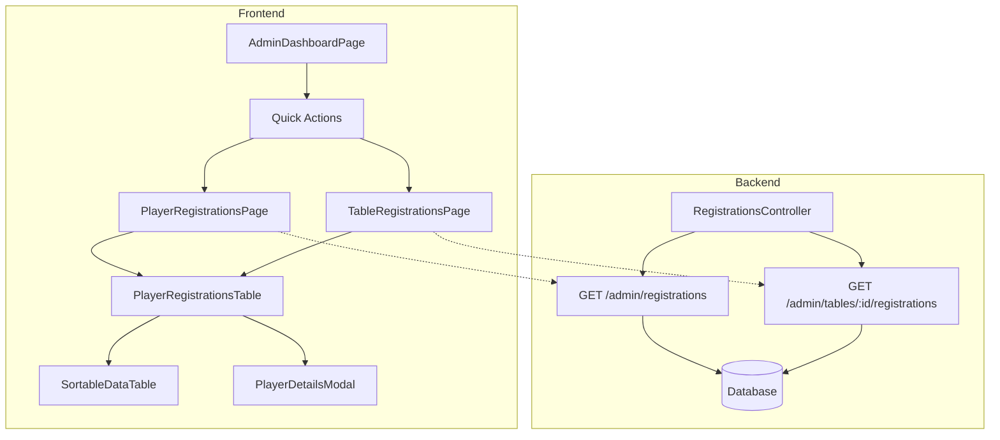

# Design: Amélioration du Dashboard Administrateur - Listings Joueurs

## Architecture Overview



## Décisions de conception

### 1. API Backend

**Choix**: Créer deux nouveaux endpoints admin dédiés

```typescript
// GET /admin/registrations
// Retourne toutes les inscriptions avec joueurs, tableaux et paiements
{
  status: "success",
  data: {
    registrations: [
      {
        id: number,
        status: string,
        createdAt: string,
        player: {
          id: number,
          licence: string,
          firstName: string,
          lastName: string,
          club: string,
          points: number,
          sex: string,
          category: string,
          bibNumber: number // depuis TournamentPlayer
        },
        table: {
          id: number,
          name: string,
          date: string,
          startTime: string
        },
        subscriber: {
          id: number,
          firstName: string,
          lastName: string,
          email: string,
          phone: string
        },
        payment: {
          id: number,
          amount: number,
          status: string,
          createdAt: string,
          helloassoOrderId: string | null
        } | null
      }
    ],
    tournamentDays: string[] // Jours distincts pour le filtre
  }
}

// GET /admin/tables/:id/registrations
// Même format mais filtré pour un tableau spécifique
```

**Justification**:
- Un seul appel API pour charger toutes les données nécessaires
- Le filtrage par jour se fait côté frontend (données déjà en mémoire)
- Évite les appels multiples lors du changement de filtre
- Les jours du tournoi sont déduits des dates de tableaux

### 2. Structure du composant mutualisé

```typescript
interface PlayerRegistrationRow {
  registrationId: number
  playerId: number
  bibNumber: number
  firstName: string
  lastName: string
  licence: string
  points: number
  club: string
  sex: string
  category: string
  tableId: number
  tableName: string
  tableDate: string
  tableStartTime: string
  registrationStatus: string
  subscriber: SubscriberInfo
  payment: PaymentInfo | null
}

interface PlayerRegistrationsTableProps {
  // Données
  registrations: PlayerRegistrationRow[]
  
  // Configuration
  showDayFilter?: boolean     // Afficher le filtre par jour
  showTableColumn?: boolean   // Afficher la colonne tableau
  tournamentDays?: string[]   // Jours disponibles pour le filtre
  
  // Callbacks
  onPlayerClick?: (playerId: number) => void
}
```

### 3. Modale de détails

La modale utilise le composant `Dialog` existant (Shadcn/Radix) et affiche les informations en sections :

```
┌─────────────────────────────────────────┐
│  Détails du joueur         [X]         │
├─────────────────────────────────────────┤
│  👤 JOUEUR                              │
│  ─────────────────────────────────────  │
│  Jean DUPONT                            │
│  Dossard: #42                           │
│  Licence: 123456 │ Points: 1250         │
│  Club: TT Paris │ Cat: Senior M         │
├─────────────────────────────────────────┤
│  📧 CONTACT INSCRIPTEUR                 │
│  ─────────────────────────────────────  │
│  Marie Martin                           │
│  marie.martin@email.com                 │
│  06 12 34 56 78                         │
├─────────────────────────────────────────┤
│  💳 PAIEMENT                            │
│  ─────────────────────────────────────  │
│  Montant: 45,00 €                       │
│  Statut: ✓ Payé                         │
│  Date: 15/01/2026                       │
│  Réf: HA-ABC123                         │
├─────────────────────────────────────────┤
│  🏓 TABLEAUX INSCRITS                   │
│  ─────────────────────────────────────  │
│  • Tableau Senior 1 - Sam 18 Jan 10h00  │
│    Statut: ✓ Confirmé                   │
│  • Tableau Senior 2 - Sam 18 Jan 14h00  │
│    Statut: ⏳ Liste d'attente (#3)      │
└─────────────────────────────────────────┘
```

### 4. Navigation admin

Ajout d'un lien "Inscriptions" dans la navigation admin :
- Dashboard (existant)
- Tournoi (existant)
- Tableaux (existant)
- **Inscriptions** (nouveau)
- Sponsors (existant)

### 5. Agrégation des données joueur

Un même joueur peut avoir plusieurs inscriptions (plusieurs tableaux). Le listing doit :
- **Option A**: Afficher une ligne par inscription (avec répétition joueur)
- **Option B**: Afficher une ligne par joueur (avec agrégation des tableaux)

**Choix retenu: Option B** - Une ligne par joueur
- Plus naturel pour "compter les joueurs d'un jour"
- La colonne "Tableaux" liste tous les tableaux du joueur (filtrés par jour si applicable)
- Plus cohérent avec le besoin "listing des joueurs"

Implementation:
```typescript
// Côté frontend, agrégation par playerId
const playerRows = useMemo(() => {
  const byPlayer = new Map<number, AggregatedPlayerRow>()
  
  for (const reg of filteredRegistrations) {
    const existing = byPlayer.get(reg.playerId)
    if (existing) {
      existing.tables.push(reg.table)
      existing.registrationIds.push(reg.registrationId)
    } else {
      byPlayer.set(reg.playerId, {
        ...reg,
        tables: [reg.table],
        registrationIds: [reg.registrationId]
      })
    }
  }
  
  return Array.from(byPlayer.values())
}, [filteredRegistrations])
```

## Risques et mitigations

| Risque | Impact | Mitigation |
|--------|--------|------------|
| Performances avec beaucoup d'inscriptions | Moyen | Pagination côté API si > 500 inscriptions |
| Incohérence données agrégées | Faible | Agrégation déterministe par ordre de date |
| Modale trop chargée | Faible | Sections collapsibles ou tabs si nécessaire |

## Tests à prévoir

### API
- Obtention des inscriptions avec toutes les relations
- Filtrage par tableau spécifique
- Réponse vide si aucune inscription

### Frontend
- Affichage du tableau avec données
- Filtrage par jour
- Recherche textuelle
- Tri par colonne
- Ouverture/fermeture de la modale
- Affichage correct des infos dans la modale
