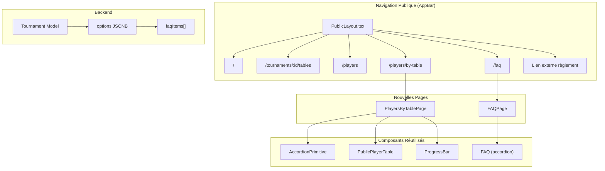

# Design : enhance-public-navigation

## Vue d'ensemble de l'architecture

Cette modification enrichit la navigation publique sans changer fondamentalement l'architecture existante. Elle étend le modèle de données du tournoi et ajoute de nouvelles pages réutilisant les composants existants.

## Diagramme de flux



## Extension du modèle Tournament

### Nouvelle structure `TournamentOptions`

```typescript
interface FAQItem {
  id: string      // UUID pour l'identification
  question: string
  answer: string
  order: number   // Pour le tri
}

interface TournamentOptions {
  refundDeadline: string | null
  waitlistTimerHours: number
  registrationStartDate: string | null
  registrationEndDate: string | null
  faqItems: FAQItem[] // NOUVEAU
}
```

## Architecture des nouvelles pages

### PlayersByTablePage

Cette page affiche tous les tableaux en accordéon :

```
┌─────────────────────────────────────────────────────────┐
│  Joueurs inscrits par tableau                           │
├─────────────────────────────────────────────────────────┤
│  ┌─────────────────────────────────────────────────────┐│
│  │ ▼ Tableau A - 18-24h Senior              [###···] 24/32 ││
│  ├─────────────────────────────────────────────────────┤│
│  │ Licence  | Nom       | Prénom  | Pts  | Club       ││
│  │ 123456   | DUPONT    | Jean    | 1250 | TT PARIS   ││
│  │ ...                                                  ││
│  └─────────────────────────────────────────────────────┘│
│  ┌─────────────────────────────────────────────────────┐│
│  │ ▶ Tableau B - 8h30 Vétérans              [####··] 28/36 ││
│  └─────────────────────────────────────────────────────┘│
└─────────────────────────────────────────────────────────┘
```

### FAQPage

Page simple utilisant le composant `FAQ` existant avec les données du tournoi :

```
┌─────────────────────────────────────────────────────────┐
│  Foire Aux Questions                                    │
├─────────────────────────────────────────────────────────┤
│  ┌──────────────────────────────────────────────────────┐
│  │ ▼ Comment puis-je m'inscrire ?                      │
│  ├──────────────────────────────────────────────────────┤
│  │ Pour vous inscrire, rendez-vous sur la page...      │
│  └──────────────────────────────────────────────────────┘
│  ┌──────────────────────────────────────────────────────┐
│  │ ▶ Quelle est la politique de remboursement ?        │
│  └──────────────────────────────────────────────────────┘
└─────────────────────────────────────────────────────────┘
```

## Administration FAQ

### Formulaire d'édition

Dans la page de configuration du tournoi, une nouvelle section "FAQ" avec :

1. **Liste des questions existantes** : Affichage en carte avec Q/R, boutons éditer/supprimer
2. **Bouton "Ajouter une question"** : Ouvre un dialogue pour saisir question + réponse
3. **Réordonnancement** : Boutons ↑/↓ pour changer l'ordre d'affichage

### Validation

```typescript
// Validator VineJS
const faqItemSchema = vine.object({
  id: vine.string().uuid(),
  question: vine.string().minLength(5).maxLength(500),
  answer: vine.string().minLength(10).maxLength(2000),
  order: vine.number().positive()
})

const tournamentOptionsSchema = vine.object({
  // ... existant
  faqItems: vine.array(faqItemSchema).optional()
})
```

## Décisions techniques

### Pourquoi stocker la FAQ dans `options` plutôt qu'une table séparée ?

- **Simplicité** : Évite une migration de schéma complexe
- **Cohérence** : Suit le pattern existant pour les options du tournoi
- **Volume faible** : Généralement < 20 items FAQ, volume JSON acceptable
- **Pas de relations** : Les FAQ n'ont pas besoin de FK ou de requêtes complexes

### Réutilisation vs nouveaux composants

| Composant | Action |
|-----------|--------|
| `FAQ` (accordion) | Réutilisé pour FAQPage |
| `PublicPlayerTable` | Réutilisé pour PlayersByTablePage |
| `Progress` | À créer (simple barre de progression) |
| Navigation items | Refactorisation de PublicLayout |

### Gestion du lien "Inscription"

Le lien "Inscription" doit pointer vers `/tournaments/:id/tables`. Comme nous n'avons qu'un tournoi actif, nous récupérons l'ID du tournoi via le hook `usePublicTournaments()`.

## Considérations UX

### Affichage conditionnel dans la navigation

| Condition | Liens affichés |
|-----------|----------------|
| Pas de tournoi actif | Aucun lien (message "Aucun tournoi") |
| Tournoi sans FAQ | Tous sauf "FAQ" |
| Tournoi sans rulesLink | Tous sauf "Règlement" |
| Inscriptions fermées | "Inscription" désactivé visuellement |

### Responsive

- **Desktop** : Liens horizontaux dans l'app bar
- **Mobile** : Menu burger avec tous les liens en vertical
